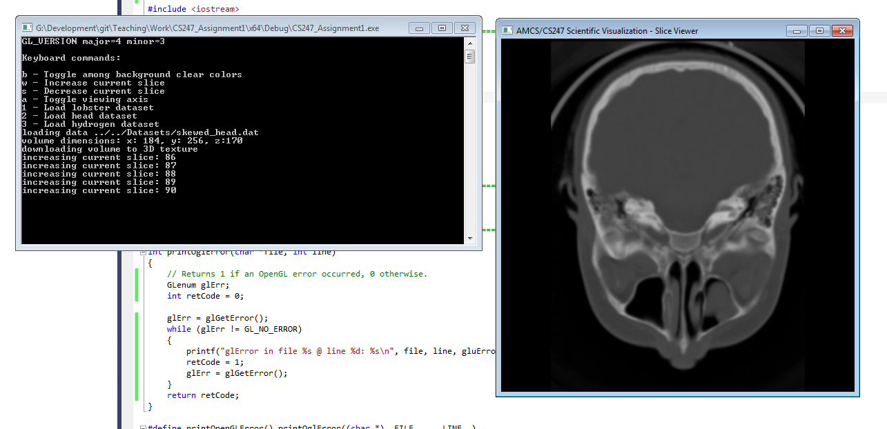

# Assignment 1 Description (7% of total grade) #
**Due: February 13th**

Display slice along user-specified axis and slice position!

## Minimum Requirements ##

* Download data into 3D volume texture. (10 points)
* Display 3 different axis-aligned slices using OpenGL texture mapping and the 3D volume texture. (60 points)
* The slice position should be adjustable for each slice view. (15 points)
+ Make sure the aspect ratio of the shown slices is correct. (data aspect ratio) (15 points)
    * If the window is resized, the slice is resized with the correct aspect ratio (no distortions) 

## Bonus ##

* Show all three axis aligned slices at once. (+6 points)
* Show arbitrarily (not orthogonal) aligned slice(s) with an interface to change the angle of the slice. (+15 points)

## Screenshots for Minimum Requirements Solution ##

